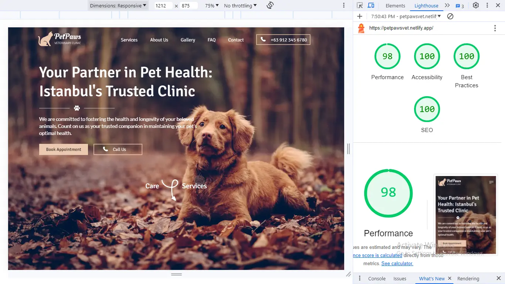
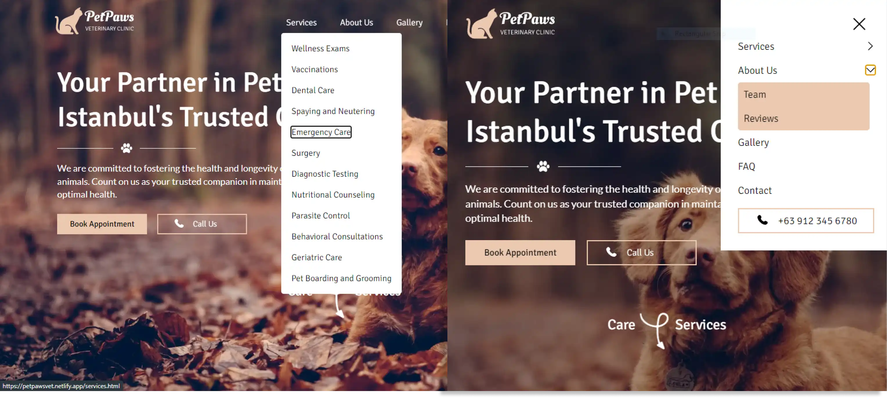
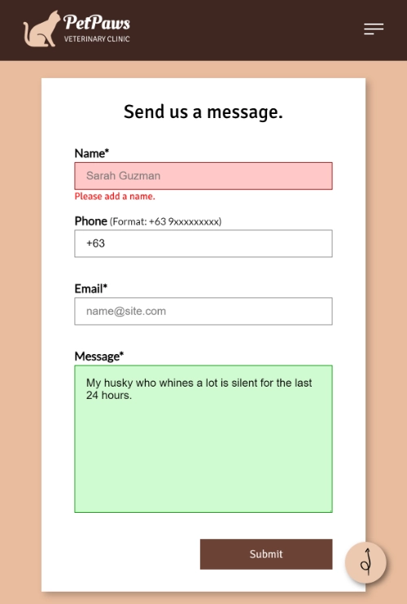
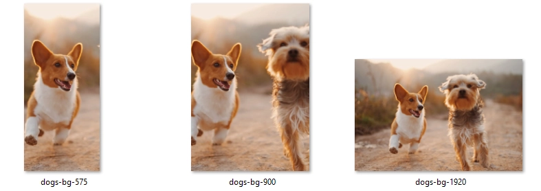

# [Live](https://petpawsvet.netlify.app/)
#### [_Figma_](https://www.figma.com/file/KwkDKOVITojO4g9HNhPubE/PetPaws-Care-Clinic?type=design&node-id=0%3A1&mode=design&t=dk2KoTfHcq68nSs5-1)

The homepage focuses on [web vitals](https://web.dev/articles/vitals), [image optimization](https://developer.mozilla.org/en-US/docs/Learn/HTML/Multimedia_and_embedding/Responsive_images), and [WAI-ARIA basics](https://developer.mozilla.org/en-US/docs/Learn/Accessibility/WAI-ARIA_basics). It was developed mobile first, experiencing design with figma, and generated copywriting with chatgpt. After making the [dental website](https://github.com/john0ground/DentaPure), I decided to add more background images in this page, a small gallery, and more scripts. The main purpose is to prioritize performance especially with images, adding features with the DOM, and putting accessibility into practice.



## Key Features
[ACCESSIBILITY](#accessibility)  
[UI](#ui)  
[PERFORMANCE OPTIMIZATION](#performance-optimization)  

### ACCESSIBILITY
**Accessible Dropdown Links** - allows navigation through the sublinks on the navbar using the tab key on desktop and within the hamburger menu. This was implemented with the index.js and core-style.css recently developed on the [dental page](https://github.com/john0ground/DentaPure).  



**Error Message Handling** - applied aria-attributes (aria-invalid, aria-errormessage) on forms for invalid inputs.

``` javascript
        case true:
            input.setAttribute('aria-invalid', 'false');
            input.removeAttribute('aria-errormessage');
            spanError.setAttribute('aria-hidden', 'true');
            break;
        case false:
            input.setAttribute('aria-invalid', 'true');
            spanError.removeAttribute('aria-hidden');
            spanError.textContent = errorMessage;    // see form.js on scripts
            input.setAttribute('aria-errormessage', spanError.id);
            break;
```

**Accordion Accessibility** - making the 'h3' questions on FAQ navigable with applied "aria-expanded" and "aria-controls".

``` html
        <div class="question">
            <h3 id="faq-question1" tabindex="0" aria-expanded="false" aria-controls="faq-answer1">What are your veterinary services?
            </h3>
            <div class="icon"></div>
        </div>
```
```html
    <div class="answer" id="faq-answer" aria-labelledby="faq-question1">
            <p>
                Lorem ipsum dolor sit amet consectetur adipisicing elit. Nulla quas consectetur rquibusdam rerum repudiandae saepe commodi cumque hic vero.
            </p>
        </div>
```

### UI
**Scroll-Aware Header** - The header maximizes screen visibility by hiding when the user scrolls down and reappears upon scrolling up. Additionally, the background color fades out when the header is positioned at the top of the page.


**Form Visual Feedback** - The input UI updates when it loses focus, providing visual indications of valid or invalid input. Error messages dynamically appear based on invalid values entered by the user. The function below shows error messages for the 'name' input.



```javascript
    const onlySpaces = /^ +$/;
    const onlyLetters = /^[A-Za-z\s]+$/;

    function verifyName(content) {
    const result = new InputStateData(false, '');

    if (onlySpaces.test(content) || content.length === 0) {
        result.errorMessage = 'Please add a name.'
    } else if (!onlyLetters.test(content)) {
        result.errorMessage = 'Please enter only letters.'
    } else {
        result.state = true;
    }

    return result;
}
```

### PERFORMANCE OPTIMIZATION
**Gallery Lazy-loading** -  Optimized image thumbnails are implemented using the 'srcset' attribute, ensuring efficient loading for various screen sizes. High-resolution images are dynamically loaded when clicked.


```html
        
```
```javascript
    function displayImage(e) {
        imgElement.removeAttribute('src');  //  tag inside the modal
        setLoadingIcon();
    
        const imageThumbnail = e.target.querySelector('img');
        const imageSrc = imageThumbnail.dataset.highres;
        imgElement.setAttribute('src', imageSrc);
    
        imageModal.showModal();
    }

    imgElement.addEventListener('load', hideLoadingIcon);
```

**Image Compression and Format** - To ensure reduced bandwidth, various compressed images are provided for different screen sizes. I used the [squoosh](https://github.com/GoogleChromeLabs/squoosh?tab=readme-ov-file) webapp for compression and converting them to webp. 


